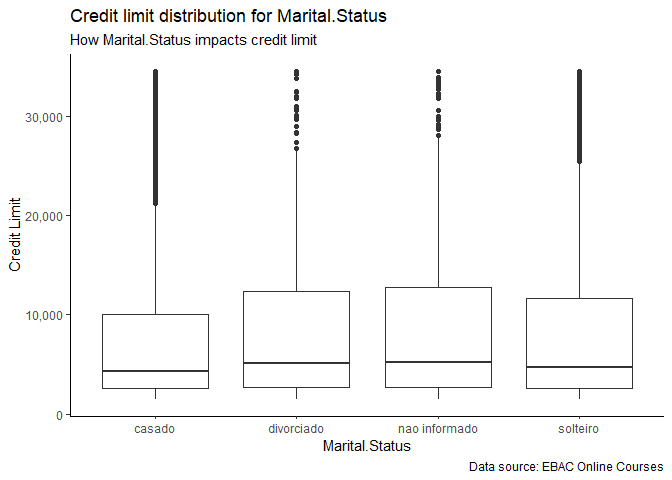
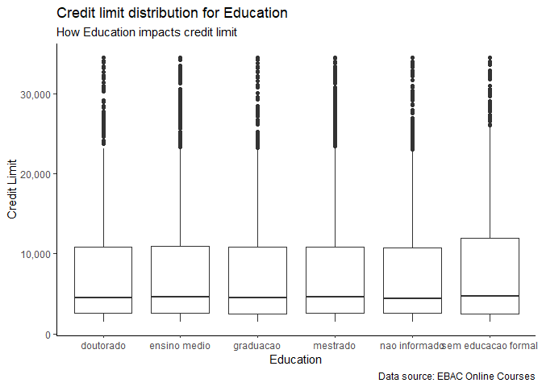
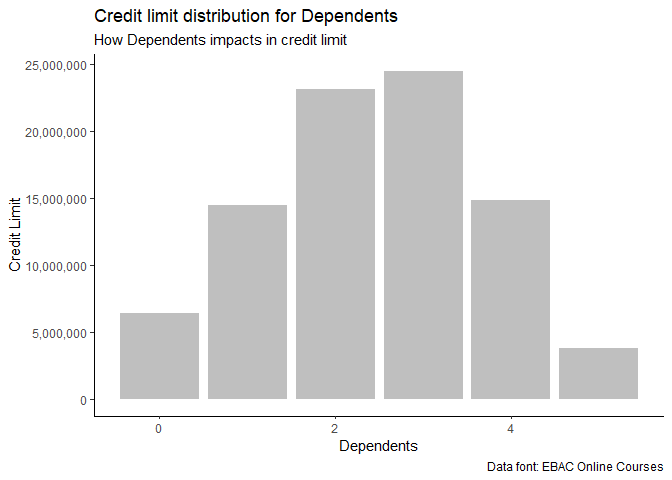

Credit Analysis
================

# Introduction

This project aims to evaluate the creditworthiness of individuals by
analyzing various financial and demographic factors. By leveraging
statistical techniques and machine learning models, the analysis seeks
to identify patterns and predictors of credit risk, helping lenders make
informed decisions.

# Data Exploration/Insights and Interpretation

So, first, let’s see the head of our data.

``` r
# Showing data head
knitr::kable(head(data), 'pipe')
```

| Age | Gender | Dependents | Education           | Marital.Status | Annual.Salary   | Card.Type | Months.of.Relationship | Products | Iterations.12m | Number.of.Months.Inactive.12m | Transactions.Amount.12m | Transactions.12m | Credit.Limit |
|----:|:-------|-----------:|:--------------------|:---------------|:----------------|:----------|-----------------------:|---------:|---------------:|------------------------------:|------------------------:|-----------------:|-------------:|
|  45 | M      |          3 | ensino medio        | casado         | \$60K - \$80K   | blue      |                     39 |        5 |              3 |                             1 |                 1144.90 |               42 |     12691.51 |
|  49 | F      |          5 | mestrado            | solteiro       | menos que \$40K | blue      |                     44 |        6 |              2 |                             1 |                 1291.45 |               33 |      8256.96 |
|  51 | M      |          3 | mestrado            | casado         | \$80K - \$120K  | blue      |                     36 |        4 |              0 |                             1 |                 1887.72 |               20 |      3418.56 |
|  40 | F      |          4 | ensino medio        | nao informado  | menos que \$40K | blue      |                     34 |        3 |              1 |                             4 |                 1171.56 |               20 |      3313.03 |
|  40 | M      |          3 | sem educacao formal | casado         | \$60K - \$80K   | blue      |                     21 |        5 |              0 |                             1 |                  816.08 |               28 |      4716.22 |
|  44 | M      |          2 | mestrado            | casado         | \$40K - \$60K   | blue      |                     36 |        3 |              2 |                             1 |                 1088.07 |               24 |      4010.69 |

In this dataset, we can see various information about the bank’s
customers, such as their age, gender, education, how many children they
have, marital status, their monthly earnings and expenses, how long the
customer has been affiliated with the bank and, our target feature, how
much is your credit limit on the card.

To make it possible to understand what affects the credit limit, let’s
study some variables and their behavior when correlated with our future
‘output’. To begin with, let’s evaluate the categorical variables.

## Marital Status

``` r
# Showing data head
plot_categorical_data_with_cl(data, 'Marital.Status', 'gray75')
```

<!-- -->

## Education

``` r
# Showing data head
plot_categorical_data_with_cl(data, 'Education', 'gray75')
```

<!-- -->

Now, we’re gonna do the same rational, but with our continuous
variables.

## Dependents

``` r
# Showing data head
plot_continuous_data_with_cl(data, 'Dependents', 'gray75')
```

<!-- -->

(In the future, change it to correlation map with the continuous data)
